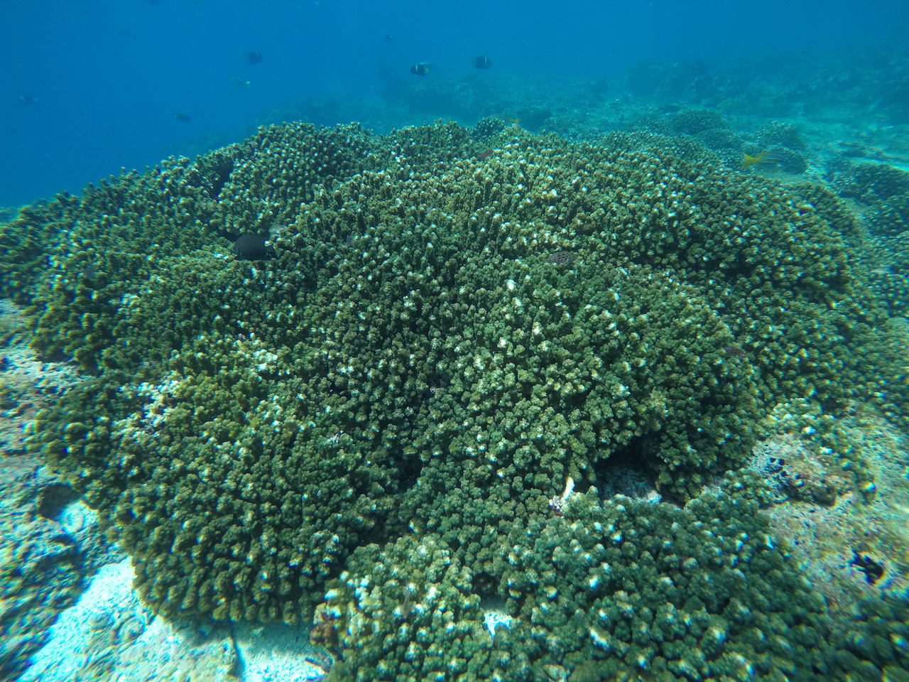

Hello world, this is the personal website for Michael T. Connelly, Ph.D. 

  

Welcome! My name is Mike Connelly, and I study coral evolution and host-microbe interactions to help support coral reef conservation and restoration efforts. I am currently a Biodiversity Genomics postdoctoral fellow at the Smithsonian Institution (SI), and I work between the National Museum of Natural History (NMNH) in Washington, D.C. and the Smithsonian Tropical Research Institute (STRI) in Panamá to study the evolution and microbial symbiosis ecology of Pocillopora corals.

