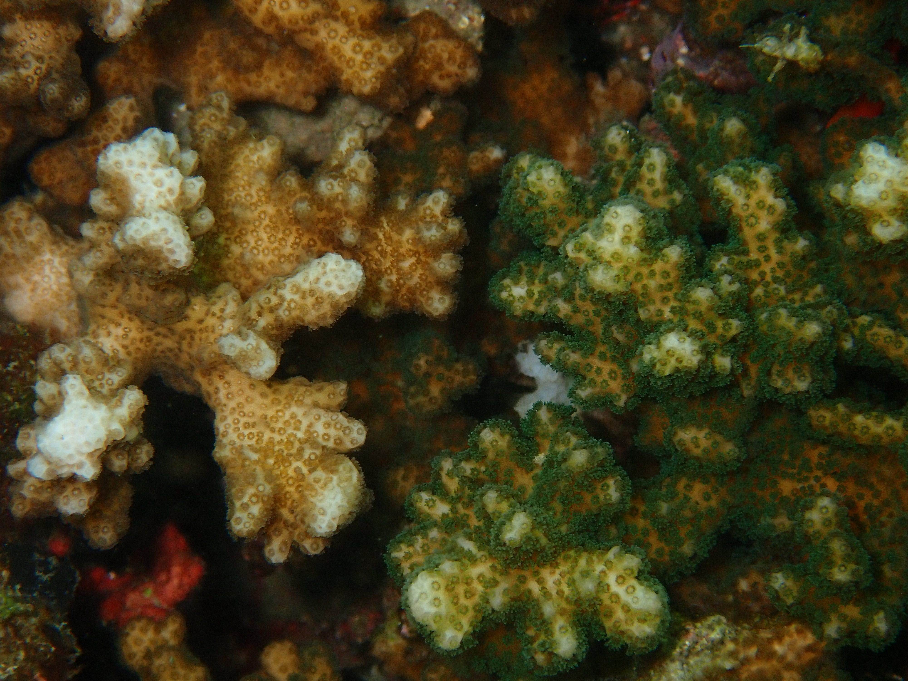

------------------------------------------------------------------------

</img>

### About me

**Hello, and welcome!** My name is Mike Connelly, and I am a marine biologist that studies cnidarian genomics to examine innovations in early animal evolution, and to reveal how host-microbe interactions impact key evolutionary processes. My overarching goal is to generate discoveries that can be translated to improve human and ecosystem health. Please reach out if you have any questions about my work, I am always happy to connect!

------------------------------------------------------------------------

I am currently a Postdoctoral Fellow at the [National Human Genome Research Institute](https://www.genome.gov/) of the [National Institutes of Health](https://www.nih.gov/). My primary focus is on the assembly and functional annotation of the *Podocoryna carnea* refence genome. This small marine hydrozoan has a transparent body and rapid life cycle that allows studies of fundamental biological processes including development, cell differentiation, and regeneration.

{width=800px align="center" style="margin: 5px 5px 5px 0"}

------------------------------------------------------------------------

### Research Interests

I am a molecular marine biologist that is interested the drivers of innovation in early animal evolution, and specifically how microbial symbiosis affects the ecology, evolution and diversification of marine invertebrates. 

To learn more, please visit the  [Projects](https://michaeltconnelly.github.io/projects.html) page.

***

{width=800px align="center" style="margin: 5px 5px 5px 0"}

