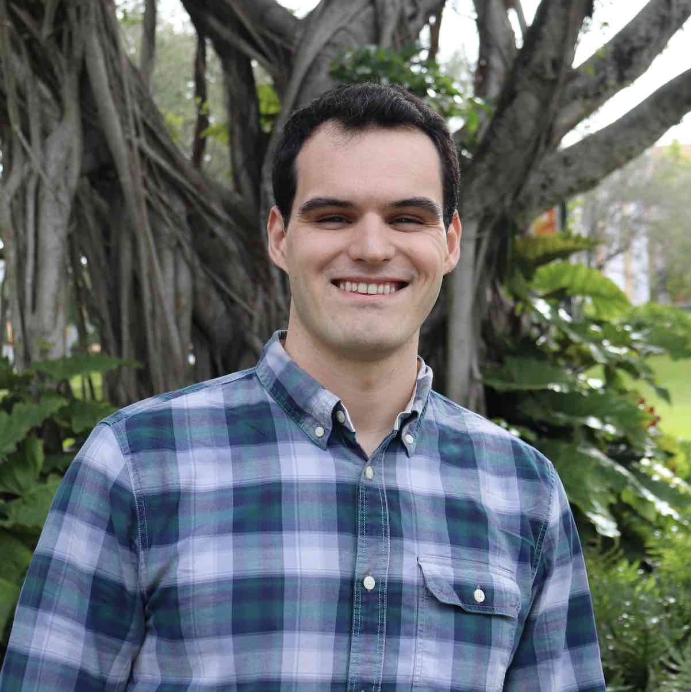

------------------------------------------------------------------------

### About me

**Hello, and welcome!** My name is Mike Connelly, and I study coral evolution and host-microbe interactions to help support coral reef conservation and restoration efforts. I am currently a Biodiversity Genomics postdoctoral fellow at the Smithsonian Institution (SI), and I work between the [National Museum of Natural History (NMNH)](https://naturalhistory.si.edu/) in Washington, D.C. and the [Smithsonian Tropical Research Institute (STRI)](https://stri.si.edu/) in Panamá to study the evolution and microbial symbiosis ecology of *Pocillopora* corals in the eastern tropical Pacific (ETP).

------------------------------------------------------------------------

### Research interests

I am a molecular marine biologist that is broadly interested in how microbial symbioses affect the ecology, evolution and diversification of marine invertebrates. I am especially interested in how these host-microbe interactions affect the ecology, evolution, and biodiversity of tropical coral reefs and deep-sea coral ecosystems.

In particular, I am fascinated by scleractinian corals in the genus *Pocillopora* because of their ecological importance, large geographic distribution, and complex microbial symbioses. My current research is using genomics and morphometrics to resolve the species-level systematics of this important coral genus, and then will use metagenomics to assess signatures of host-microbe coevolution among *Pocillopora* corals and their associated algal and bacterial symbiont communities. To learn more, please visit the [Projects](https://michaeltconnelly.github.io/projects.html) page.

