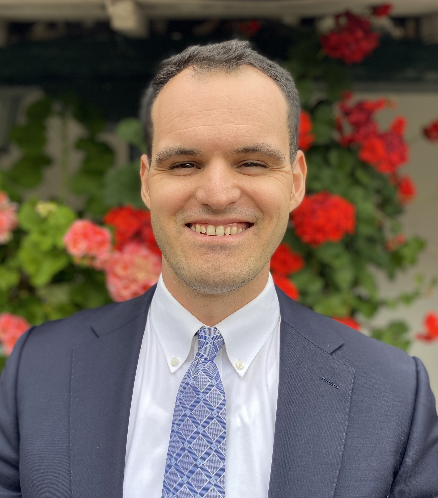
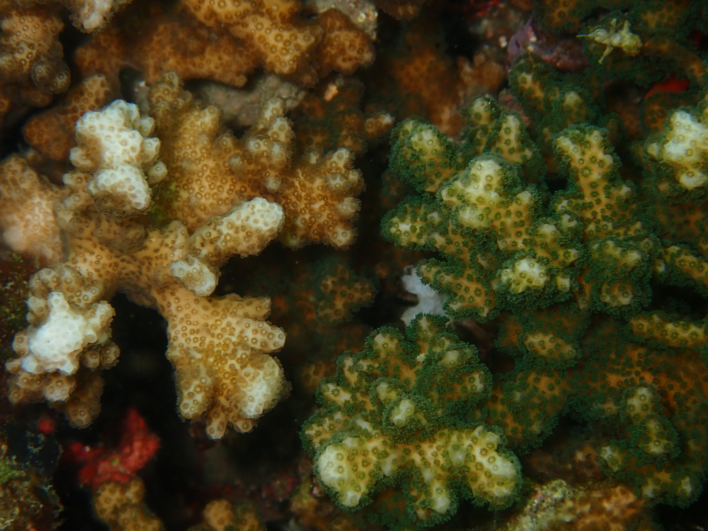

------------------------------------------------------------------------

</img>

### About me

**Hello, and welcome!** My name is Mike Connelly, and I am a marine biologist that studies cnidarian genomics to discover key innovations in early animal evolution and reveal how host-microbe interactions impact key evolutionary processes. My overarching goal is to generate discoveries that can be translated to improve human and ecosystem health. Please reach out if you have any questions about my work, I am always happy to connect!

------------------------------------------------------------------------

I am currently a Postdoctoral Fellow at the [National Human Genome Research Institute](https://www.genome.gov/) of the [National Institutes of Health](https://www.nih.gov/). My primary focus is on assembling and annotating a reference genome for the marine hydrozoan *Podocoryna*. This colonial marine hydrozoan has a transparent body and rapid life cycle that allows studies of key biological processes including development, regeneration, and cell type differentiation.

{width=800px align="center" style="margin: 5px 5px 5px 0"}

------------------------------------------------------------------------

### Research Interests

I am a marine molecular biologist that is interested the evolution and development of marine invertebrates, especially cnidarians.
I am broadly interested in the genomic processes involved in the diversification of marine species and the cell biology of development and regeneration in early-diverging animals. At the intersection of these fields I am specifically interested in how microbial symbiosis affects the ecology, evolution and diversification of marine invertebrates. 

To learn more, please visit the  [Projects](https://michaeltconnelly.github.io/projects.html) page.

***

{width=800px align="center" style="margin: 5px 5px 5px 0"}

