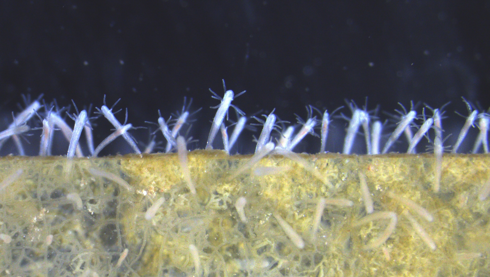

------------------------------------------------------------------------

</img>

### About me

**Hello, and welcome!** My name is Mike Connelly, and I am a marine biologist that studies cnidarian genomics to uncover the evolutionary origins of early animals' neuromuscular and immune systems, and to reveal how host-microbe interactions have shaped early animal evolution. My overarching goal is to generate discoveries that can be translated to improve human and ecosystem health. Please reach out if you have any questions about my work, I am always happy to connect!

------------------------------------------------------------------------

I am currently a Postdoctoral Fellow at the [National Human Genome Research Institute](https://www.genome.gov/) of the [National Institutes of Health](https://www.nih.gov/). My primary focus is on the assembly and functional annotation of the *Podocoryna carnea* refence genome. This small freshwater hydrozoan has a transparent body and rapid life cycle that allows studies of fundamental processes such regeneration, cell differentiation, and organismal development.

{width=800px align="center" style="margin: 5px 5px 5px 0"}

------------------------------------------------------------------------

I am also a Research Associate at the Smithsonian Institution  [National Museum of Natural History (NMNH)](https://naturalhistory.si.edu/) in Washington, D.C., working with collaborators at the [Smithsonian Tropical Research Institute (STRI)](https://stri.si.edu/) in Panamá to study the evolution and microbial symbiosis ecology of *Pocillopora* corals in the eastern tropical Pacific (ETP).

{width=800px align="center" style="margin: 5px 5px 5px 0"}

------------------------------------------------------------------------

### Research Interests

I am a molecular marine biologist that is broadly interested in early animal evolution, and how microbial symbioses affect the ecology, evolution and diversification of marine invertebrates. I am especially interested in how these host-microbe interactions affect the ecology, evolution, and biodiversity of tropical coral reef ecosystems.

In particular, I am fascinated by scleractinian corals in the genus *Pocillopora* because of their ecological importance, large geographic distribution, and complex microbial symbioses. Some of my current research is using genomics and morphometrics to resolve the species-level systematics of this important coral genus, and then will use metagenomics to assess signatures of host-microbe coevolution among *Pocillopora* corals and their associated algal and bacterial symbiont communities. To learn more, please visit the [Projects](https://michaeltconnelly.github.io/projects.html) page.

{width=800px align="center" style="margin: 5px 5px 5px 0"}

