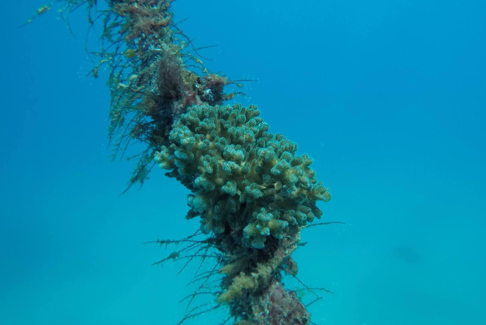

***

### Conference Presentations

  * 3rd Joint Congress on Evolutionary Biology, July 2024  
    {width="75%"}
  
  * Smithsonian Tropical Microbial Ecology Symposium, May 2021  
    {width="75%"}
  
***

### Public Audience Presentations

  * Smithsonian Science Cafe, May 2022  
    {width="75%"}
  
  * Subtropical Experiments: Corals Above and Below, July 2020  
    {width="75%"}
  
  * 3-Minute Thesis, March 2020  
    {width="75%"}
  
***

\ 

