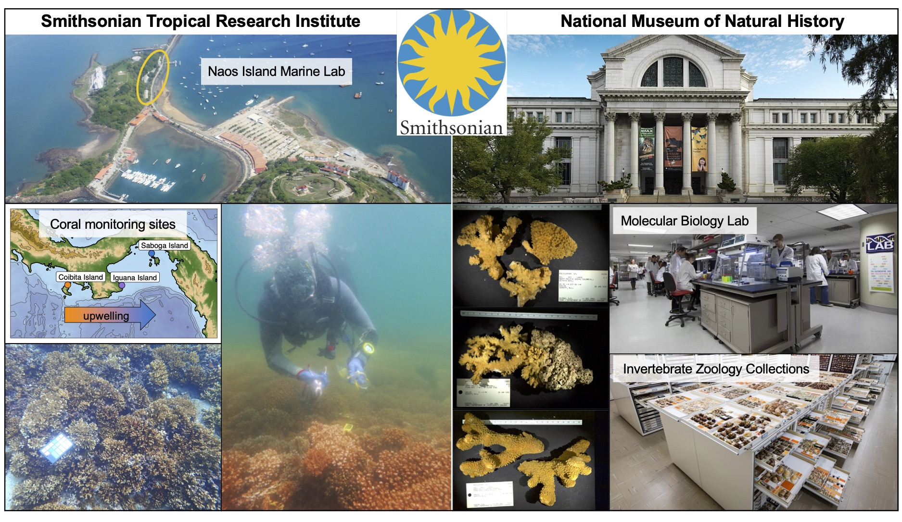
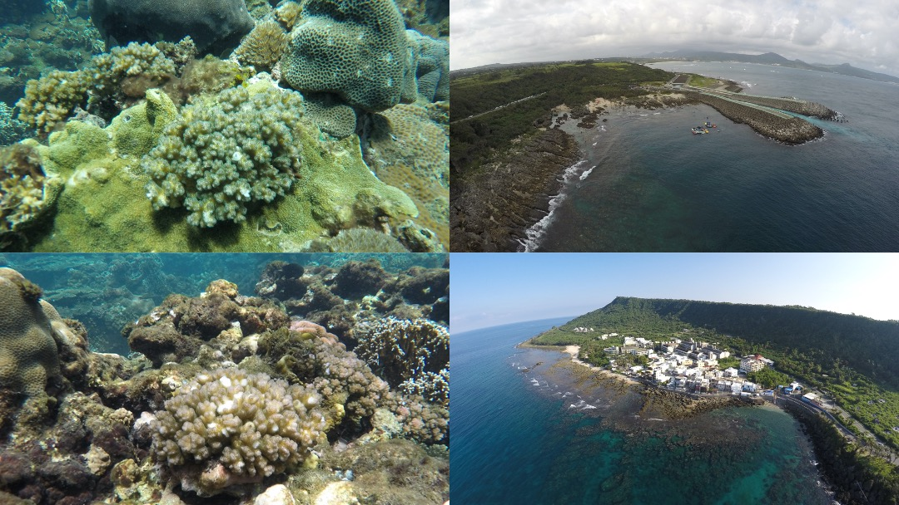

***

### Smithsonian Biodiversity Genomics Fellowship
My current postdoctoral research is using genomic methods to delimit *Pocillopora* coral species and re-assess the morphology-based taxonomy for this important and widespread coral genus, focusing first on the eastern tropical Pacific (ETP) region. I am working between the [National Museum of Natural History (NMNH)](https://naturalhistory.si.edu/) in the [Invertebrate Zoology (IZ)](https://naturalhistory.si.edu/research/invertebrate-zoology) department's [Coral Lab](https://naturalhistory.si.edu/research/invertebrate-zoology/research/quattrini-lab) and the [Smithsonian Tropical Research Institute (STRI)](https://stri.si.edu/).

The Smithsonian's research platform in Panamá and Washington are key for this project. The [Naos Marine & Molecular Laboratories](https://stri.si.edu/facility/naos) are an excellent launch point to several field sites in the ETP that span a gradient of seasonal wind-driven upwelling from Isla Coiba in the Gulf of Chiriquí to Isla Saboga in the Gulf of Panamá. Field-collected *Pocillopora* coral samples from these sites have been transported to the NMNH for genomic and morphometric species delimitation analyses and comparisons to historical *Pocillopora* specimens in the IZ department collections. 

![**Project summary.** (**A**) The *Pocillopora* coral holobiont comprises the coral host and symbiotic algae and bacteria, some of which are transmitted between host generations. (**B**) Phylosymbiosis occurs when the relationships between symbiotic microbial communities recapitulate host phylogenetic relationships. 
(**C**) Coral branch morphology and corallite microstructure for three *Pocillopora* species last revised in Schmidt-Roach et al. (2014), correspondence between genetics and morphological characters has not been assessed for the eight morphospecies that are present in Panamá. (**D**) Location of STRI coral monitoring sites in the Gulf of Chiriquí and Gulf of Panamá. (**E**) Locations and numbers of preserved Pocillopora coral specimens in the NMNH Invertebrate Zoology collections. 
](./images/Figure1_SIFP.JPG)

My hope is that an improved taxonomy of these critical coral species will be a valuable resource for scientists studying coral reef species distributions and interactions in marginal ecosystems and will reveal the fundamental co-evolutionary processes that help generate coral species diversity in other eco-regions.

***  

### Ph.D. research on *Pocillopora* host-microbe interactions
I completed my Ph.D. at the University of Miami [Rosenstiel School of Marine and Atmospheric Science](https://www.rsmas.miami.edu/) (RSMAS), working in the [Cnidarian Immunity Laboratory](https://cnidimmunitylab.com/) with Dr. Nikki Traylor-Knowles as my Ph.D. advisor. 

During my Ph.D. I completed an NSF East Asia and Pacific Summer Institutes (EAPSI) fellowship in Taiwan, where I studied *Pocillopora* coral gene expression and bacteria community shifts in response to experimental treatments with bacteria lipopolysaccharide, antibiotics, and heat stress that were intended to disrupt normal host-bacteria interactions. The publications that resulted from these experiments can be found [here](https://doi.org/10.1016/j.dci.2020.103717) and [here](https://doi.org/10.3389/fmars.2021.814124).

I also was involved in projects funded by the Florida Department of Environmental Protection that investigated the gene expression of diverse Caribbean coral species in response to infection with the Stony Coral Tissue Loss Disease (SCTLD), the results of which are published [here](https://doi.org/10.3389/fmars.2021.681563).

***  

### Other current projects
* Physiology and transcriptome responses of *Pocillopora* corals to antibiotic microbiome suppression - [GitHub Link](https://github.com/michaeltconnelly/coral_antibiotics_physiology)
* Meta-analysis of *Pocillopora* RNAseq datasets in the NCBI SRA - [GitHub Link](https://github.com/michaeltconnelly/MetaPocillopora)
* Genomic species delimitation of *Pocillopora* corals in the eastern tropical Pacific of Panama
* Coral conservation genetics for reef restoration workshop, in partnership with [Raising Coral Costa Rica](https://www.raisingcoral.org/) - [Course Website](https://michaeltconnelly.github.io/RaisingCoral_CoralGeneticsWorkshop_2022/)
