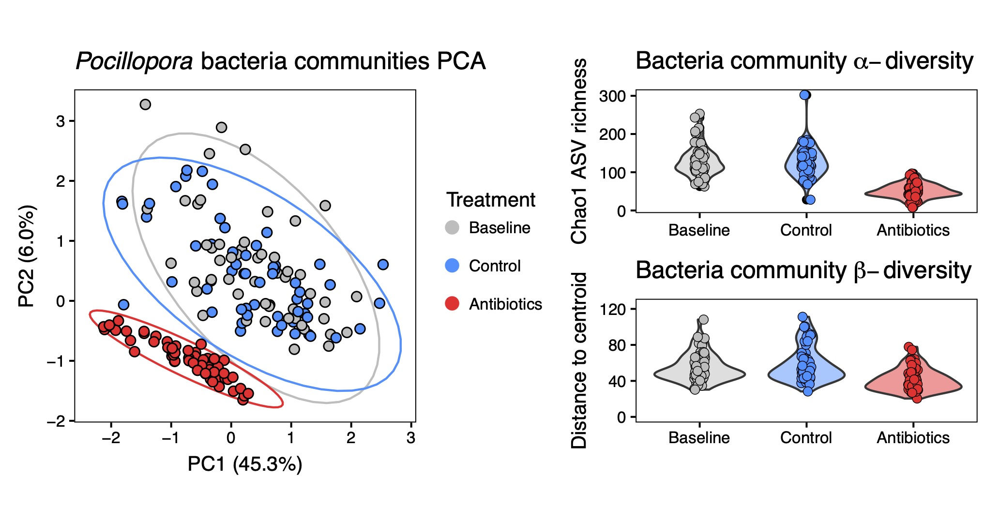

## Paper on *Pocillopora*-bacteria interactions published in Molecular Ecology!

I am thrilled to share that my manuscript titled "Antibiotics reduce Pocillopora coral-associated bacteria diversity, decrease holobiont oxygen consumption, and activate immune gene expression" has been published in Molecular Ecology! This research delves into the intricate relationships within Pocillopora coral holobiont, uncovering significant insights on how antibiotics treatments reduce bacterial diversity and cause immune activation. These findings contribute to our understanding of coral health and pave the way for further exploration in coral-microbe interactions. I invite you to explore the detailed findings in the published manuscript, available now at [this link](https://doi.org/10.1111/mec.17049)!

 

\ 

## STRI Rohr Reef Resilience Project 2023 Galápagos Islands Expedition

In March 2023, the Rohr Reef Resilience (RRR) project team at STRI partnered with the S/Y Acadia and researchers at the Charles Darwin Foundation (CDF) to survey coral reefs and coral ecosystems in the Galápagos Islands. My role on the project was to take photos and collect samples of *Pocillopora* corals across the the islands of Floreana, Isabela, Wolf, Darwin, Santiago, and Baltra, while the RRR team established monitoring transects, performed fish censuses and obtained water, sediment, and eDNA samples from each site.

 

\ 

 

\ 

## 2022 Workshop on Coral Genetics for Conservation and Restoration

In July 2022, I collaborated Raising Coral Costa Rica and the University of Costa Rica Centro de Investigaciones en Ciencias del Mar y Limnologia (CIMAR) to host the first workshop on *Pocillopora* coral genetics for conservation and restoration in Costa Rica. During the workshop, DNA extracts from 45 Pocillopora coral colonies were prepared at the CIMAR laboratories using the Qiagen DNeasy PowerSoil Pro kit, and PCR amplicons for mitochondrial barcoding loci were prepared.

For more information, check-out the [course website](https://michaeltconnelly.github.io/RaisingCoral_CoralGeneticsWorkshop_2022/).

 

\ 

## 3D Photogrammetry

Updates coming soon! 

