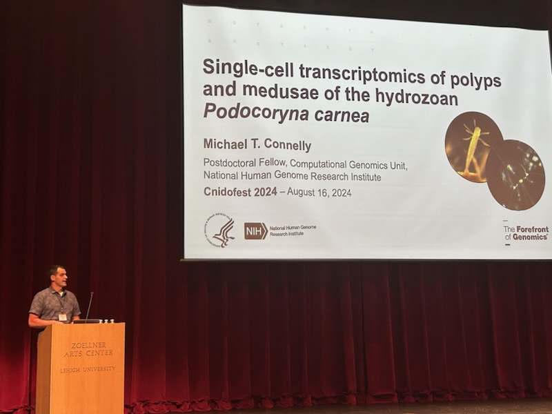
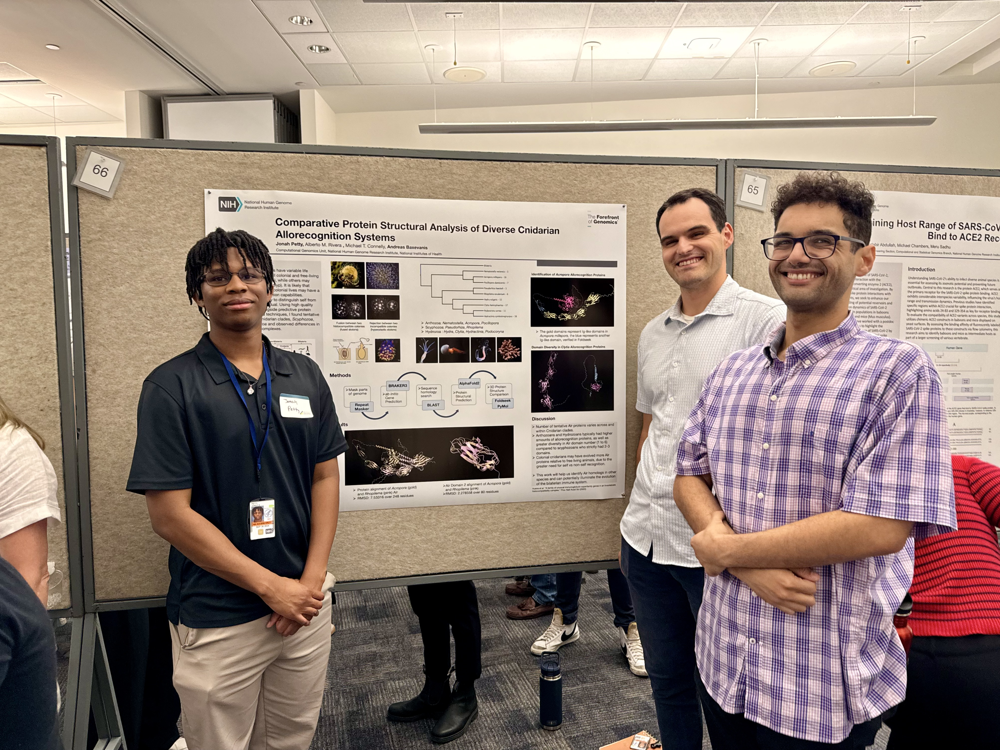
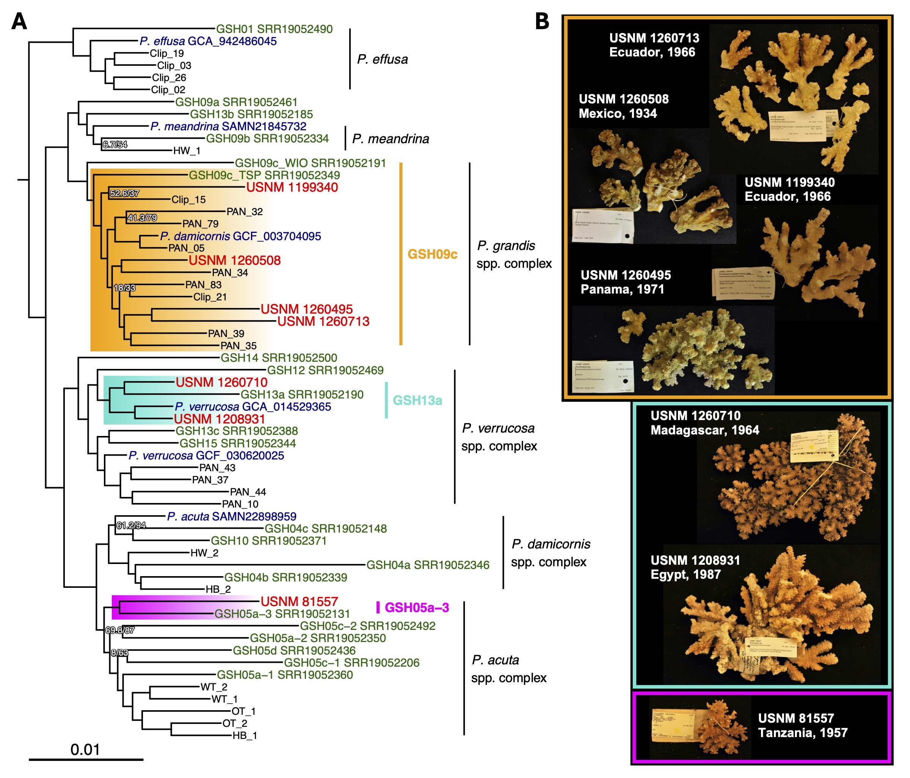
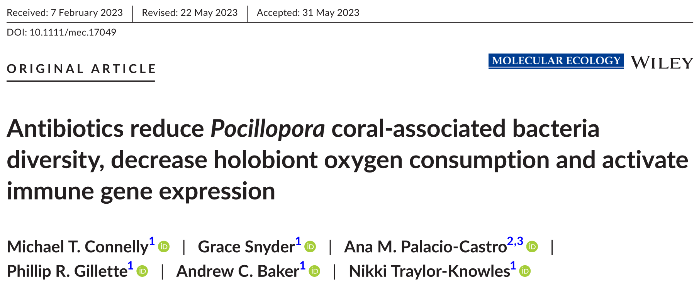

## Summer 2024 conferences: *Pocillopora* coral diversity at Evolution, *Podocoryna* scRNAseq at Cnidofest!

I greatly enjoyed presenting my research at two conferences in July and August 2024, first at the 3rd Joint Congress on Evolutionary Biology in Montreal, Canada, and later at Cnidofest 2024 in Bethlehem, Pennsylvania! You can watch the recording from the Evolution conference at [this link](https://www.youtube.com/watch?v=Md7D4jyhMNs&list=PLnl_pi1g6Uve0ZkdmIUjGw3fu91avxcE3&index=230) to see the most current results from my *Pocillopora* coral genomics research. At Cnidofest, I presented the preliminary results from our work to build a *Podocoryna* single-cell atlas, and greatly enjoyed re-introducing myself to the cnidarian model system research community!

{width=600px style="margin: 5px 5px 5px 0"}

\ 

## NIH/NHGRI Summer Intership Program poster session highlights utility of protein structural methods for uncovering cnidarian allorecognition systems

This summer, the Baxevanis lab at the NHGRI hosted Jonah Petty from the University of Maryland, Baltimore County for an 8-week internship where he learned computational methods in genomic analysis such as gene model prediction, BLAST searches, and protein structural predictions with AlphaFold2. Jonah applied these approaches to explore the diversity of cnidarian allorecognition systems, focusing on a suite of model cnidarians from across the phylum with various body plans (solitary vs. colonial) and life history strategies (benthic vs. free-living) to see if these traits are linked to the number of allorecognition (ALR) protein homologs and diversity of protein domain architectures found in their genomes. Jonah discovered some very interesting trends that we will be exploring further in future work, and we are excited that he is returning to the lab this fall!

{width=600px style="margin: 5px 5px 5px 0"}

\ 

## Beginning research on cnidarian muscle, gut, and nervous system evolution at the National Institutes of Health - National Human Genome Research Institute (NHGRI)

I have begun a new fellowship at the NIH, merging my interests in cnidarian evolution, immunology, and health in Dr. Andy Baxevanis' lab in the NHGRI Computational Genomics Unit! I will be working on genome assemblies and single-cell RNAseq projects seeking to understand the evolutionary origins of complex tissues such as muscle, gut, and nervous systems, while exploring their relevance to immune functions and host-microbe interactions in diverse cnidarian species. Our work will begin in *Podocoryna carnea*, also known as the "Smooth-spined snailfur."

\ 

## New paper on leveraging dry stony coral specimens for museum genomics now published in Coral Reefs!

A new paper from my Smithsonian Biodiversity Genomics fellowship is now available at the journal *Coral Reefs*, titled "Unlocking the treasure trove: leveraging dry coral specimens for museum genomics". This project is the first to demonstrate that historical DNA (hDNA), or DNA <200 years old, can be extracted from dry coral museum specimens and used for target-enrichment sequencing to recover ultraconserved elements (UCEs) for phylogenetic analysis. In this work, we demonstrate that *Pocillopora* coral specimens up to 90 years old can be used for genomic analysis and placed in the context of contemporary biodiversity. There are many important consequences for using historical specimens for genomics - we can now turn back the clock and examine changes in coral biodiversity, symbiosis, and adaptation over the past several decades, and by including type specimens in future analyses, we can resolve many taxonomic problems without the need to collect new "topotype" specimens from the field! Please give the paper a read at [this link](https://doi.org/10.1007/s00338-024-02525-5) to see how you can apply these methods to your own research, and email me directly if you would like a free copy of the PDF!

{width=600px style="margin: 5px 5px 5px 0"}

\ 

## *Pocillopora* host-bacteria interactions paper published in Molecular Ecology!

I am thrilled to share that my manuscript titled "Antibiotics reduce Pocillopora coral-associated bacteria diversity, decrease holobiont oxygen consumption, and activate immune gene expression" has been published in Molecular Ecology! This research delves into the intricate relationships within Pocillopora coral holobiont, uncovering significant insights on how antibiotics treatments reduce bacterial diversity and cause immune activation. These findings contribute to our understanding of coral health and pave the way for further exploration in coral-microbe interactions. I invite you to explore the detailed findings in the published manuscript, available now at [this link](https://doi.org/10.1111/mec.17049)!

{width=600px style="margin: 5px 5px 5px 0"}

\ 

## STRI Rohr Reef Resilience Project 2023 Galápagos Islands Expedition

In March 2023, the Rohr Reef Resilience (RRR) project team at STRI partnered with the S/Y Acadia and researchers at the Charles Darwin Foundation (CDF) to survey coral reefs and coral ecosystems in the Galápagos Islands. My role on the project was to take photos and collect samples of *Pocillopora* corals across the the islands of Floreana, Isabela, Wolf, Darwin, Santiago, and Baltra, while the RRR team established monitoring transects, performed fish censuses and obtained water, sediment, and eDNA samples from each site.

{width=600px style="margin: 5px 5px 5px 0"}

\ 

{width=600px style="margin: 5px 5px 5px 0"} 

\ 

## 2022 Workshop on Coral Genetics for Conservation and Restoration

In July 2022, I collaborated Raising Coral Costa Rica and the University of Costa Rica Centro de Investigaciones en Ciencias del Mar y Limnologia (CIMAR) to host the first workshop on *Pocillopora* coral genetics for conservation and restoration in Costa Rica. During the workshop, DNA extracts from 45 Pocillopora coral colonies were prepared at the CIMAR laboratories using the Qiagen DNeasy PowerSoil Pro kit, and PCR amplicons for mitochondrial barcoding loci were prepared.

For more information, check-out the [course website](https://michaeltconnelly.github.io/RaisingCoral_CoralGeneticsWorkshop_2022/).

{width=600px style="margin: 5px 5px 5px 0"}

